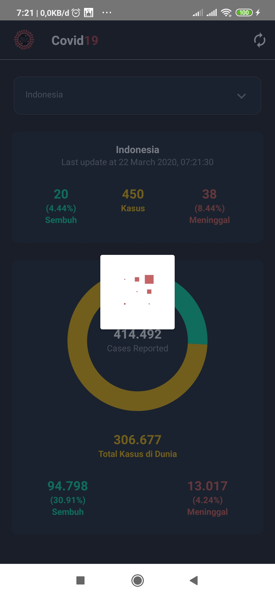
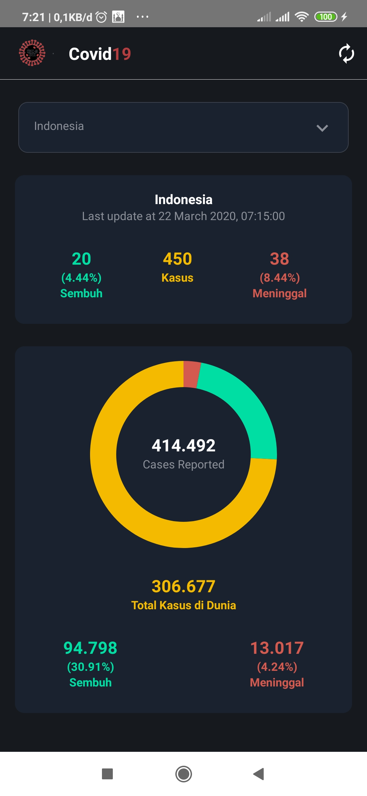
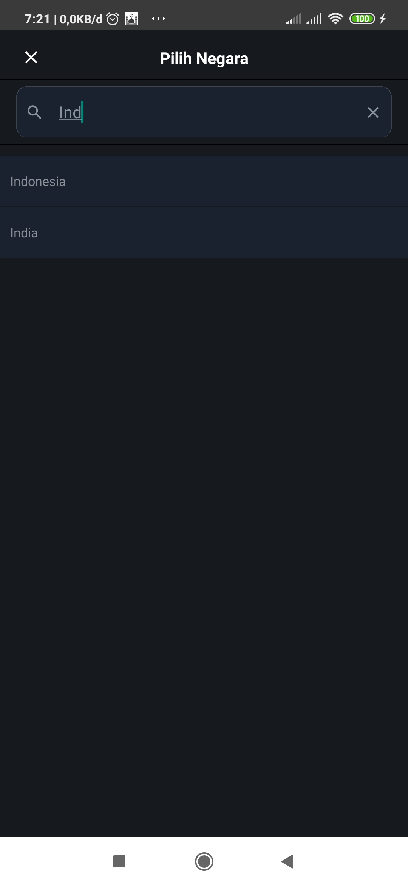

<h1 align="center">Covid19 App</h1>

  
  

  Built with React Native

  <a href="https://corona.lmao.ninja/" target="_blank">
    Data source: https://corona.lmao.ninja/
  </a>

## Table of Contents

- [Introduction](#introduction)
- [Requirements](#requirements)
- [Usage](#usage-for-development)
- [Screenshot](#screenshot)
- [Release APK](#release-apk)
- [Contact](#contact)
- [Contributors](#contributors)

## Introduction

<b>Covid19 App</b> is a Mobile application that can be used to see update data of covid19 case.

## Requirements

- [`npm`](https://www.npmjs.com/get-npm)
- [`react-native`](https://facebook.github.io/react-native/docs/getting-started)
- [`react-native-cli`](https://facebook.github.io/react-native/docs/getting-started)

## Usage for development

1. Open your terminal or command prompt
2. Type `git clone https://github.com/ihsan2/Covid19-Update.git`
3. Open the folder and type `npm install` for install dependencies
4. Type `react-native run-android` for run this app. **_Make sure your device is connected with debugging mode_**.

## Screenshot

       
      
      

## Release APK

## Contact

If you want to contact me you can reach me at <nihsan727@gmail.com>.

Copyright © 2020 by Nur Ihsan

## Contributors

  <table>
    <tr>
      <td align="center">
        <a href="https://github.com/ihsan2">
           
          <b>Nur Ihsan</b>
        </a>
      </td>
    </tr>
  </table>

